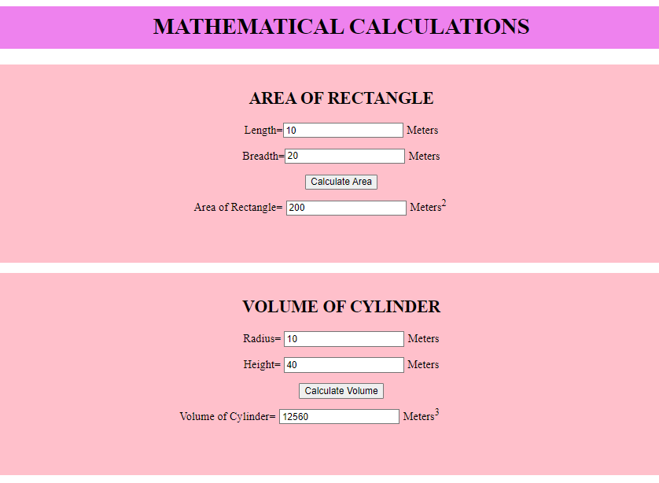

# AngularCalculation

# Web Page for Mathematical Calculations using Angular

## AIM:
To design a dynamic website to perform mathematical calculations using Angular Framwork

## DESIGN STEPS:

### Step 1:

Requirement collection.

### Step 2:

Creating the layout using HTML and CSS in component.html file

### Step 3:

Write typescript to perform the calculations.

### Step 4:

Validate the layout in various browsers.

### Step 5:

Validate the HTML code.

### Step 6:

Publish the website in the given URL.

## PROGRAM :


RECTANGLE.HTML :-

```

      <div [ngStyle]="{'background-color': 'pink','text-align':'center','padding-top':'15px','padding-bottom':'15px','margin-bottom':'15px','height':'250px'}">
    <h2>AREA OF RECTANGLE</h2>
    <div [ngStyle]="{'padding-bottom':'10px'}">
    Length=<input type="text" [(ngModel)]="length"  [ngStyle]="{'margin-bottom':'5px','margin-right':'5px'}">Meters<br/>
    </div>
    <div  [ngStyle]="{'padding-bottom':'10px'}">
    Breadth=<input type="text" [(ngModel)]="breadth"  [ngStyle]="{'margin-bottom':'5px','margin-right':'5px'}">Meters<br/>
    </div>

    <input type="button" [ngStyle]="{'margin-bottom':'5px'}" value="Calculate Area" (click)="onCalculate()"><br/>
    <div  [ngStyle]="{'padding-top':'5px','padding-right':'60px'}">
    Area of Rectangle=<input type="text" [value]="area" [ngStyle]="{'margin-top':'5px','margin-left':'5px','margin-right':'5px'}">Meters<sup>2</sup>
    </div>
</div>
```

RECTANGLE.TS :-

```

import { Component } from "@angular/core";


@Component({
    selector:'Rectangle-Area',
    templateUrl:'./rectangle.component.html',
    
})

export class RectangleComponent{
    length:number;
    breadth:number;
    area:number;
    constructor(){
        this.length=10;
        this.breadth=20;
        this.area=this.length*this.breadth;
    }
    onCalculate(){
        this.area=this.length*this.breadth
    }
}
````

CYLINDER.HTML :-

```

<div [ngStyle]="{'background-color': ' pink','text-align':'center','padding-top':'15px','padding-bottom':'20px','height':'250px'}">
    <h2>VOLUME OF CYLINDER</h2>
    <div [ngStyle]="{'padding-bottom':'10px'}" >
        Radius=
        <input type="text" [(ngModel)]="radius" [ngStyle]="{'margin-bottom':'5px','margin-right':'5px'}">Meters<br/>
    </div>
    <div [ngStyle]="{'padding-bottom':'10px'}">
        Height=
    <input type="text" [(ngModel)]="height" [ngStyle]="{'margin-bottom':'5px','margin-right':'5px'}">Meters<br/>
    </div>

    <input type="button" [ngStyle]="{'margin-bottom':'5px'}" value="Calculate Volume" (click)="onCalculateVol()"><br/>
    <div [ngStyle]="{'padding-top':'5px','padding-right':'90px'}" >

        Volume of Cylinder=<input type="text" [value]="volume" [ngStyle]="{'margin-top':'5px','margin-left':'5px','margin-right':'5px'}">Meters<sup>3</sup>
    </div>

</div>
```

CYLINDER.TS :-

```

import { Component } from "@angular/core";

@Component({
    selector:'Cylinder-Volume',
    templateUrl:'./cylinder.component.html',
    
    
})
export class CylinderComponent{
    radius:number;
    height:number;
    volume:number;
    pi:number;
    constructor(){
        this.radius=10;
        this.height=40;
        this.pi=3.14;
        this.volume=this.pi*this.radius*this.radius*this.height
    }
    onCalculateVol(){
        this.volume=this.pi*this.radius*this.radius*this.height
    }
}
```
APP.COMPONRNT.HTML :-

```
<h1 [ngStyle]="{'background-color':'violet','height':'50px','padding-top':'10px','text-align':'center'}">MATHEMATICAL CALCULATIONS</h1>
<Rectangle-Area></Rectangle-Area>
<Cylinder-Volume></Cylinder-Volume>

```

APP.MODULE.TS :-

```
import { NgModule } from '@angular/core';
import { FormsModule } from '@angular/forms';
import { BrowserModule } from '@angular/platform-browser';

import { AppComponent } from './app.component';
import { CylinderComponent } from './cylinder/cylinder.component';
import { RectangleComponent } from './rectangle/rectangle.component';

@NgModule({
  declarations: [
    AppComponent,RectangleComponent,CylinderComponent
  ],
  imports: [
    BrowserModule,FormsModule
  ],
  providers: [],
  bootstrap: [AppComponent]
})
export class AppModule { }

````


## OUTPUT:



## Result:
Hence a Angular Project is developed to do Mathematical Calculations.